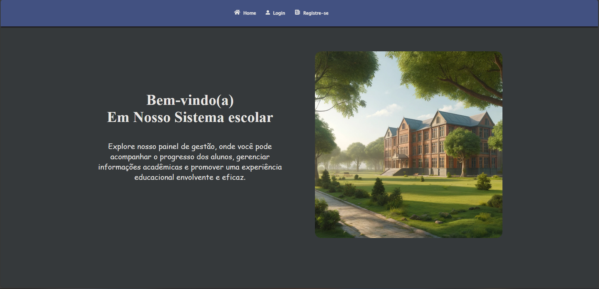

# React.js Front para API_ESCOLA

## <a href="https://github.com/edsuuu/api_escola" target="_blank">Repositorio da API</a>



### Descrição

Front Para consumo da api_escola,

# Tecnologias usadas

- Axios
- Lodash
- React-icons
- React-redux
- React-router-dom 6
- React-toastify
- Redux
- Redux-saga
- Styled-components
- Validator

### Clonar o repositório

```bash
git clone https://github.com/edsuuu/front-escola.git
```

### Acessar a pasta do repositorio

```bash
cd front-escola
```

### Instalar as Dependencias e Iniciar o projeto Local

```bash
npm install && npm start
```
